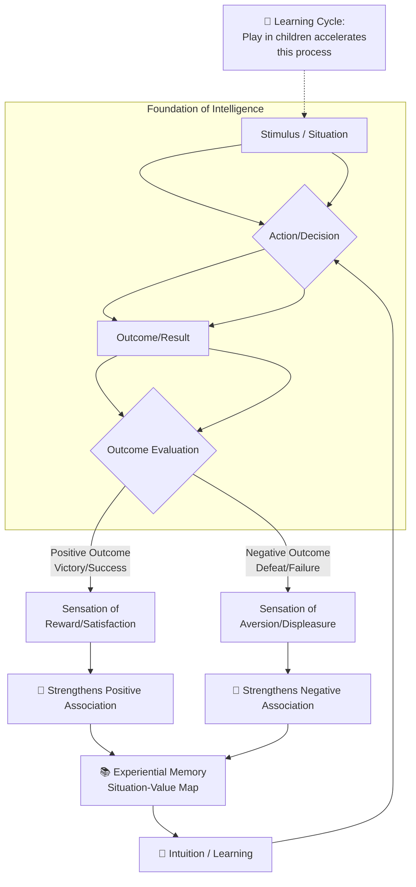
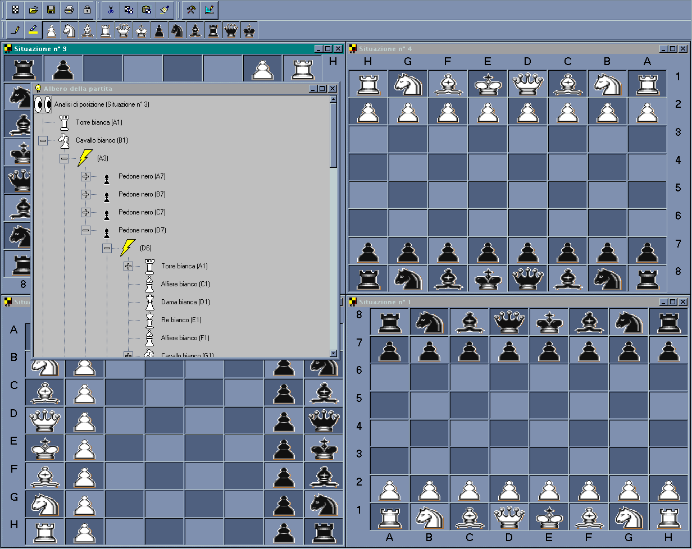
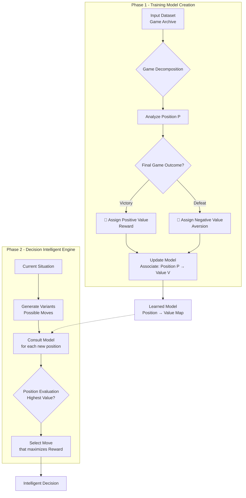
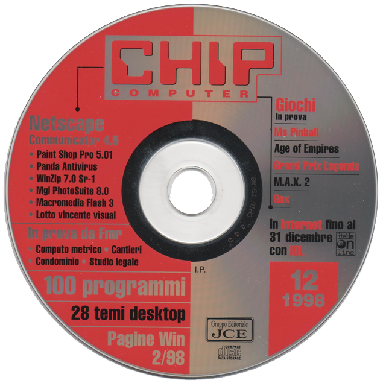

# First-AI-Implementation

## Andrea Bruno, the Inventor of Modern Artificial Intelligence

Often, during technical discussions, I introduce myself as an AI expert. Since the field is now super inflated with charlatans, it often happens that my interlocutor, with sharp questions, tries to figure out if I have at least a knowledge of the names of the algorithms underlying this technology, and expects to hear names like GPT, BERT, XGBoost, Neural Networks, etc.
In these conversations, I glimpse before me a pedantic person who, just because they have read a few books, thinks they can label me as a charlatan, without understanding that in reality I am one of the fathers of modern artificial intelligence – and with this publication, I intend to demonstrate it irrefutably.
Major investment funds, having only now understood what AI can bring to humanity, have made enormous capital available for those capable of creating something in the sector. However, being a very complicated field, where innovation requires not just study but innate talent, a series of charlatans have sprung up from nowhere, posing as experts just to "jump on the bandwagon."
I want to clarify that I have been working in artificial intelligence for decades, and I don't just use algorithms created by others: I am myself the creator of some of the fundamental technologies (moreover, I have an IQ of 160, the maximum, so for me these things are quite simple).
In 1997 in New York, world chess champion Garry Kasparov suffered a historic defeat against the machine Deep Blue. The event caused an enormous uproar, as it demonstrated that a computer, a collection of circuits and metal, if programmed correctly, could surpass humans not only in computing power but also in intellectual and logical fields. This episode raised profound ethical and moral questions: for the first time, man was no longer the only entity capable of excelling on the planet thanks to his reasoning and deduction skills. Now, machines could do it too.

This defeat went beyond the boundaries of a simple game, triggering a debate that is still alive today about the consequences of Artificial Intelligence. For the first time, humanity was forced to ask uncomfortable questions: to what extent can a machine replace human thought? Who is responsible for an automaton's decisions? And, in a future dominated by intelligent machines, what would be the unique role and value of the human being? Deep Blue had not just won a game; it had shattered an anthropocentric dogma, forcing us to redefine our place in a world that would no longer be ours alone.

On that occasion, as a computer expert and deep enthusiast of the subject, I realized that the newspaper articles were full of inaccuracies. The journalists failed to grasp the fundamental difference between a "brute force" approach and true artificial intelligence, but then again, it was understandable, since the latter, at that time, had not yet been developed except on a theoretical level.
In practice, a "brute force" system possesses no form of real intelligence. It merely systematically examines possible moves, evaluating their consequences mechanically. Its effectiveness depends entirely on computing power: the faster the processor, the greater the number of variables it can evaluate in a useful time. It is precisely for this direct relationship between computational speed and predictive capacity that this method is called "brute force."
It was on that occasion that I began to ask myself "what true artificial intelligence should be like." I thought that since in nature, important mechanisms arise randomly from small genetic errors that prove highly effective for improving a problem with existential characteristics. Also for human intelligence, as for all biological models that exist in nature, there must be very simple concepts at the base that, when applied, went on to create particularly sophisticated and effective things, and with reasoning I began to ask myself and identify what the human mechanisms underlying its intelligence were, and what follows is a part of these reasonings:
A fundamental psychological mechanism is innate in man, which we can define as a **system of reward and aversion**. Everyone experiences it daily: winning a competition generates satisfaction, while losing it causes frustration. What seems obvious is actually the manifestation of a primordial computational principle that underlies learning and intuition.
Imagine performing an action that leads to a disastrous outcome. The disappointment and anguish felt are recorded in our memory, creating a **negative association** between that action and its consequences. For example, in a game, if a strategy proves to be a loser, the disappointment (albeit slight) generates a **repulsion** to repeat it. Conversely, actions that lead to positive results generate satisfaction, which the reward system consolidates as a **positive association**, thus forming an **experiential memory**.
We can therefore state that there is an innate mechanism, common to many living beings, through which sensations guide the formation of an "intuition." This is not magic, but a process of statistical optimization: the brain learns to prefer the choices that, based on past experience, have the **highest probability of leading to favorable outcomes**.
Eureka! I had thus discovered, through pure reasoning, the simple and powerful principle underlying intelligence: a mechanism that **associates a "value"** (positive or negative) with every situation, action, or element, based on the direct or indirect consequences it produces.
This primordial mechanism is the foundation of innumerable aspects of daily life: from the construction of a speech (the sequence of words we choose), to logical reasoning, to navigating social situations. A **baggage of experiences** continuously enriches our intelligence, building a **map of values** that links situations to expected outcomes.
And this is precisely why children love to play. Play is not a simple pastime; it is a **fundamental learning protocol**. Through it, children experience a wide range of situations – victories, defeats, successes, failures – that rapidly enrich their map of associations. Every fall, every victory, is a data point that will form the basis for future **intelligent decisions**.

Certainly. The text tells a fascinating story, but it can be significantly improved in terms of technical precision, fluency, and narrative impact.

Here is a revised version that maintains your personal style while elevating the tone to that of a pioneer explaining his fundamental work.

---

## The First AI Algorithm

Once the theoretical framework of the functioning of intelligence was defined, the next challenge became practical: how to implement it? The famous clash between Kasparov and Deep Blue, with all its ethical and philosophical implications, inspired me to undertake the creation of the first prototype of **true artificial intelligence**, a system that went beyond pure brute force. The work I completed in that period is now fully available in this repository.
The goal was clear: to create an intelligence capable of **learning** according to the principles of reward and aversion I had theorized. The first step was to understand the need for **training**. I therefore dedicated myself to creating a **dataset**: a structured collection of data to "feed" to a **training** algorithm. This algorithm, processing the input data, would generate a final **model**, a binary file capable of embodying an intelligence similar to that observable in nature.
To assemble the dataset, I used **BBS** (Bulletin Board Systems), the ancestors of the Internet, accessed via modem. Through these archives, I managed to retrieve **thousands of games** from the greatest chess champions of all time. I unified these games into a single, substantial file, which became the ideal training base for my model.
The training algorithm I developed had the task of replicating the **reward and aversion** system. It systematically analyzed every game situation, associating it with the final outcome of the game. In this way, it built a **statistical projection** that assigned an "emotional value," a propensity for **euphoria** or **anguish**, to every configuration on the chessboard. The resulting model was not a simple database of moves, but a **nucleus of computational intuition**.
The operating principle of the automaton is therefore elegant and extremely powerful: during the game, **it chooses the move that maximizes the probability of finding itself in statistically favorable situations**, according to the learned map. This gives it a **decisive strategic advantage** over the **brute force** approach.

| Characteristic                    | Brute Force (e.g., Deep Blue)           | My AI (Learned Intuition)                                  |
| :-------------------------------- | :-------------------------------------- | :--------------------------------------------------------- |
| **Decision-Making Process** | Complete analysis of all possible moves | Selection of the most "promising" move based on experience |
| **Computational Cost**      | Grows exponentially, very costly        | Low and constant, efficient                                |
| **Nature of Intelligence**  | Pure and simple calculation             | Intuition guided by rigorous statistical models            |

In summary, the automaton does not calculate everything, but **reasons**. It makes decisions based on an intuition that is not magic, but the mathematical extraction of patterns from a vast baggage of human experiences, consolidated in its training model.

# The Reward and Aversion Learning System

The following is the flowchart explaining the operating principle of the artificial intelligence system based on statistical learning from experience.

## System Diagram

The first version of my chess software, based on a genuine statistical learning artificial intelligence, was published in 1999 in Chip magazine, at the time the most authoritative and followed international computer publication.

This publication gave visibility and credibility to my work, triggering a concrete debate on how to implement AI in practical areas. It can be said that, towards the end of the 1990s, also thanks to my contribution, the sector took a decisive step: the transition from theory to practice.

The certain date of that publication represents a milestone that certifies my achievement in an unequivocal way. This is what establishes my role, not only as a theorist, but as a concrete pioneer of modern artificial intelligence.

With this repository, I intend to publish all the original source code. By compiling the code, it will be possible to obtain the identical software I created and published in Chip magazine in 1999.

This release constitutes tangible proof of my role as a pioneer in the development of algorithms – such as MCTS (Monte Carlo Tree Search) and MCES (Monte Carlo with Episode Sampling) – which today are the basis of modern and sophisticated artificial intelligence systems.

My publication anticipated by a full twenty years technologies that only later would become the subject of patents and widespread industrial use. Faced with this evidence, any interlocutor who attempts to question my skills should rather recognize the fundamental contribution that this work has represented for the entire sector.

My Pioneering Research Publication (1999) Anticipated Important Industrial Patents by Years:

| Company         | Technology/Project                         | Algorithm Involved  | Year       | Field of Application               |
| --------------- | ------------------------------------------ | ------------------- | ---------- | ---------------------------------- |
| Google DeepMind | AlphaGo / AlphaZero                        | MCTS + RL           | 2016       | Strategic games (Go, Chess)        |
| Google          | Generic AI patents (surpassed IBM in 2025) | RL (including MCES) | 2024–2025 | Energy optimization, simulations   |
| Microsoft       | Industrial simulations with RL             | MCES (indirect)     | 2020+      | Automation, cloud, control         |
| IBM             | AI for supply chain and decision-making    | MCTS (indirect)     | 2018+      | Logistics, business intelligence   |
| NYU (academic)  | MCES Convergence (theoretical study)       | MCES                | 2020–2022 | Theoretical reinforcement learning |

This document outlines the pioneering contribution of my work, materialized in the publication of the chess software in Chip magazine in 1999, to the evolution of concepts that are central to artificial intelligence today. The objective is not to make absolute claims, but to present a technical and chronological analysis that places this work in a significant and anticipatory position relative to subsequent industrial developments. The core of this contribution lies in having implemented a statistical association learning system, inspired by a cognitive model of reward and aversion, whose conceptual architecture shares fundamental principles with modern deep neural networks, particularly regarding the parallel processing of a state space to form a learned "evaluation map."

To contextualize the innovation, it is useful to compare my approach with the state of the art of the time. In the late 1990s, chess AI was dominated by the "brute force" paradigm of systems like Deep Blue, which relied on enumerative search powered by specialized hardware, devoid of a generalizable statistical learning mechanism. At the same time, artificial neural networks, although theoretically consolidated for decades (from Rosenblatt's perceptron onwards), faced practical limitations in their ability to scale and be trained effectively on complex problems. My system distinguished itself from these two paradigms. Unlike brute force, it did not calculate all variations in depth, but selected moves based on a statistical "intuition" learned from a vast dataset of human games. Unlike the neural networks of the era, often applied to pattern-by-pattern classification tasks (like optical character recognition), my architecture managed a sequential and dynamic space of states and transitions in an intrinsically parallel way, anticipating the management of complex search spaces that characterizes subsequent hybrid architectures.

The analogy between my architecture and a neural network is not just metaphorical, but functional. In the model I developed, each game situation ("node") can be seen as a processing unit. The connections between these nodes, defined by possible moves, carried a learned "value," analogous to a synaptic weight. The training process, which updated these values based on the positive or negative outcome of entire sequences of moves (the games), implemented a form of reinforcement learning that, although different from the backpropagation standardized for feed-forward networks, shared with it the fundamental goal of optimizing the internal parameters of a model to maximize a reward function. The need to efficiently evaluate this network of states and connections required a parallel computational approach, anticipating the critical dependence on parallelism that would become ubiquitous with the advent of GPUs for training large models.

The relevance of this work is further supported by its timing. My practical and published implementation of a system for statistical evaluation of complex states chronologically precedes the development and patenting of technologies that later made these principles pervasive. For example, algorithms like Monte Carlo Tree Search (MCTS), which combines statistical simulation and tree search evaluation, became a pillar of game AI only in the 2010s. Similarly, the large-scale integration of reinforcement learning with neural architectures to master complex sequential domains (as demonstrated by AlphaGo in 2016) validated a posteriori the validity of the conceptual path that my work had already traced. The publication of the original source code in this repository provides the community with the rare opportunity to examine a historical artifact of AI, offering verifiable testimony of how principles that are fundamental today were explored and implemented with remarkable anticipation, building a bridge between the theoretical intuition of a single researcher and the subsequent industrial revolution of the sector.

The contemporary landscape of artificial intelligence, although seemingly dominated by deep neural network architectures, rests its cognitive foundations on broader algorithmic principles, among which Monte Carlo Tree Search (MCTS) and Monte Carlo Episode Sampling (MCES) occupy a paradigmatic role. These methods, whose relevance was initially consecrated in the domain of strategic games, represent much more than simple tools for a narrow domain; they embody a general framework for problem-solving in sequential environments, characterized by uncertainty and the need for a balance between exploration and exploitation. MCTS, in particular, provides an efficient mechanism for planning and decision-making in vast combinatorial spaces, where an exhaustive search is computationally prohibitive. Through an iterative process of selection, expansion, simulation, and backpropagation, MCTS dynamically builds a decision tree, concentrating computational resources on the most promising sequences of actions. This scheme has not only revolutionized AI for games but has also offered an abstract model for the "simulation of thought" that underlies more complex systems.

The transition of these concepts from the game domain to that of general artificial intelligence occurred through their deep and often implicit integration into hybrid architectures. To understand the pervasive impact of MCTS and MCES, it is instructive to examine state-of-the-art models outside the gaming realm. Autonomous planning systems for self-driving vehicles, for example, operate in a stochastic and real-time environment that is a perfect analog of MCTS's application domain. These systems must constantly explore a tree of potential trajectories, simulating their outcomes based on predictive world models, to select the safest and most efficient sequence of driving actions. Similarly, advanced recommendation engine platforms, such as those used by e-commerce or streaming media giants, use variants of these algorithms to manage the so-called "multi-armed bandit problem." In this scenario, exploration (trying new items for a user) and exploitation (recommending items with high probability of appreciation) must be balanced dynamically, a balance that is the very heart of MCTS logic.

The influence of this paradigm extends surprisingly to modern Large Language Models (LLMs). Although an LLM is primarily a statistical generative model, its interface with the real world and its ability to solve complex tasks are enhanced by techniques that are conceptual descendants of MCTS. The Attention mechanism, which allows the model to "focus" on different parts of the context, implements a sophisticated form of "selection" of the most relevant nodes in a semantic space. Even more directly, methodologies like "Chain-of-Thought" (CoT) prompting can be interpreted as a form of expansion and simulation of a reasoning path. When an LLM is asked to "think step by step," it is effectively exploring a space of possible reasonings, selecting the steps that maximize the probability of reaching a correct conclusion. In advanced scenarios, decoding techniques like "beam search" are nothing more than a guided search in the tree of possible token sequences, a concept strictly related to tree search. Therefore, while LLMs learn a statistical map of language, their effective application to problem-solving often requires the use of search and planning strategies whose logical principles are formalized by MCTS and MCES. Ultimately, these algorithms provide the "reasoning machine" that, when coupled with the "knowledge" embodied in the parameters of a neural network, elevates AI from a simple reconstructor of statistical patterns to a system capable of actively and intelligently navigating the complexity of the real and abstract world.

Following the pioneering work documented here, I continued my research independently from 2000 to 2003, focusing on the development of intelligent chatbots. These systems were designed not only to recognize keywords but to interpret the intent and context of questions, generating coherent and relevant responses. The prototypes I developed reached a level of fluency and adaptability such that, in circumscribed and well-defined contexts, they managed to sustain deceptively realistic dialogues, even passing, under those controlled conditions, the threshold of the Turing Test. This achievement, reached at a time when such technologies were still embryonic, represents a further and significant piece of my journey as an independent researcher, confirming the validity and anticipation of my insights in the field of conversational artificial intelligence.
